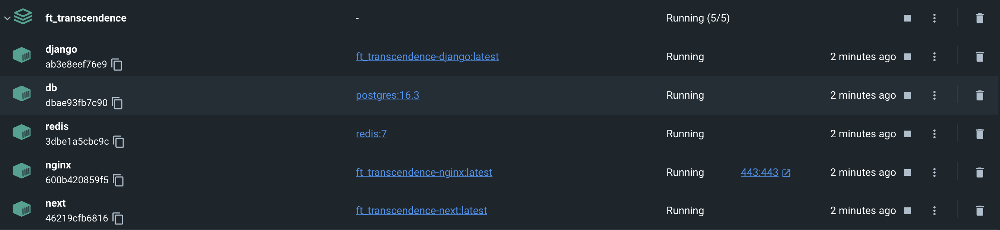
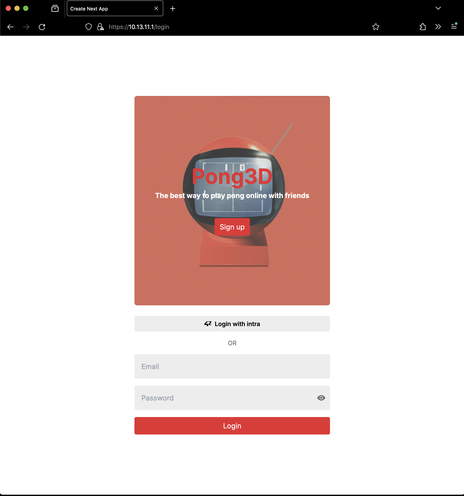
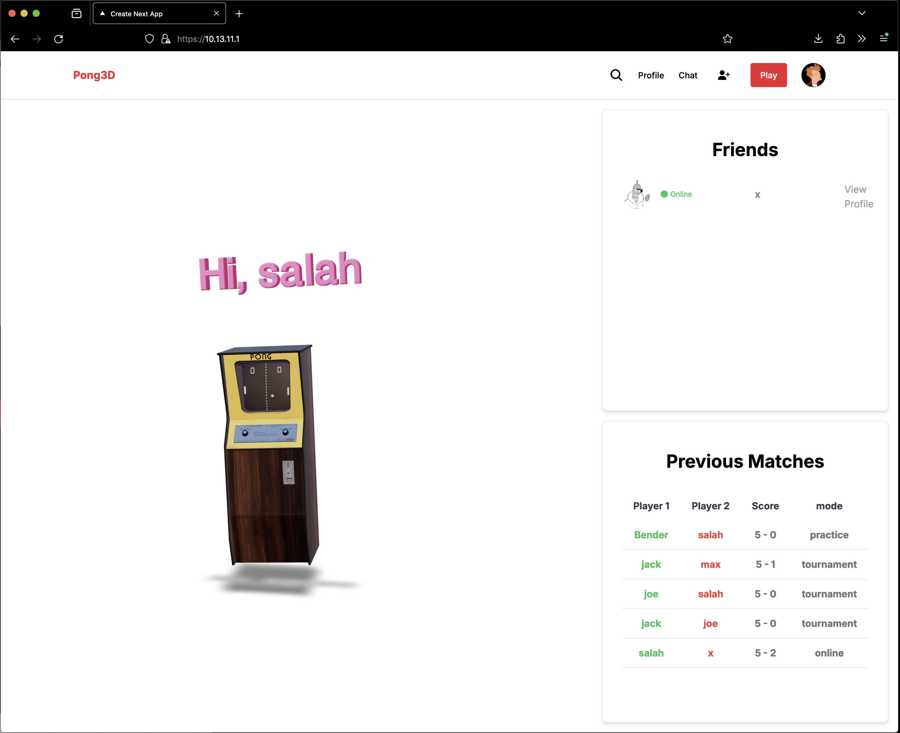
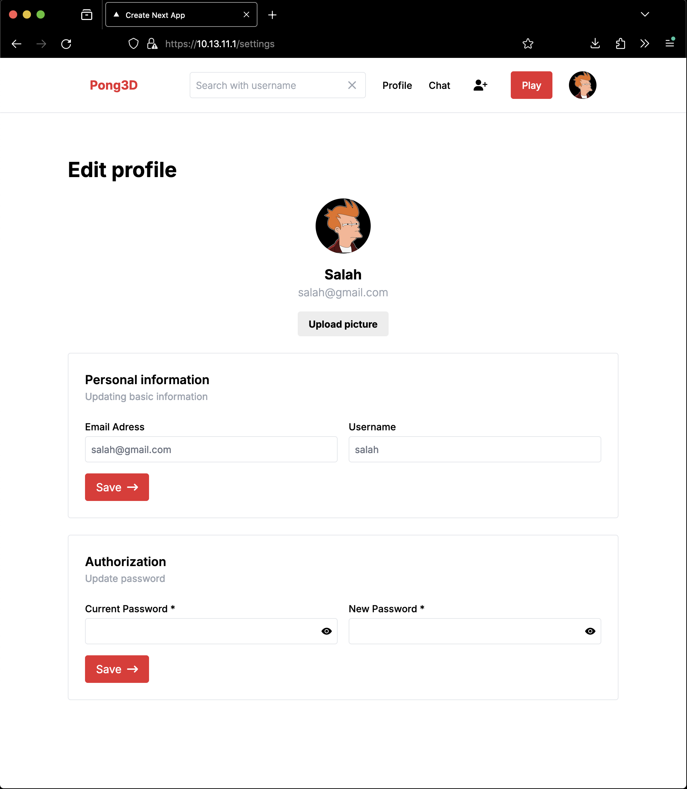
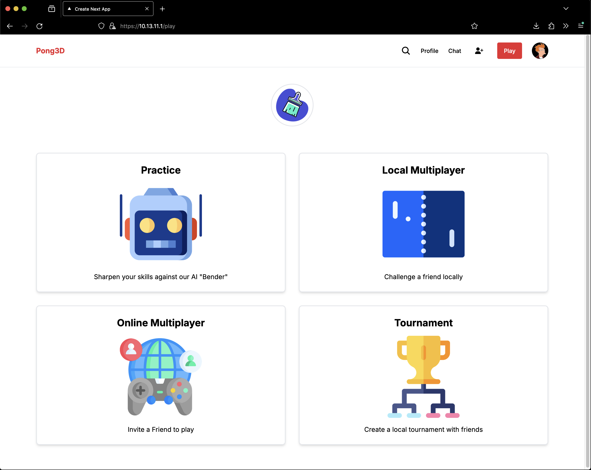
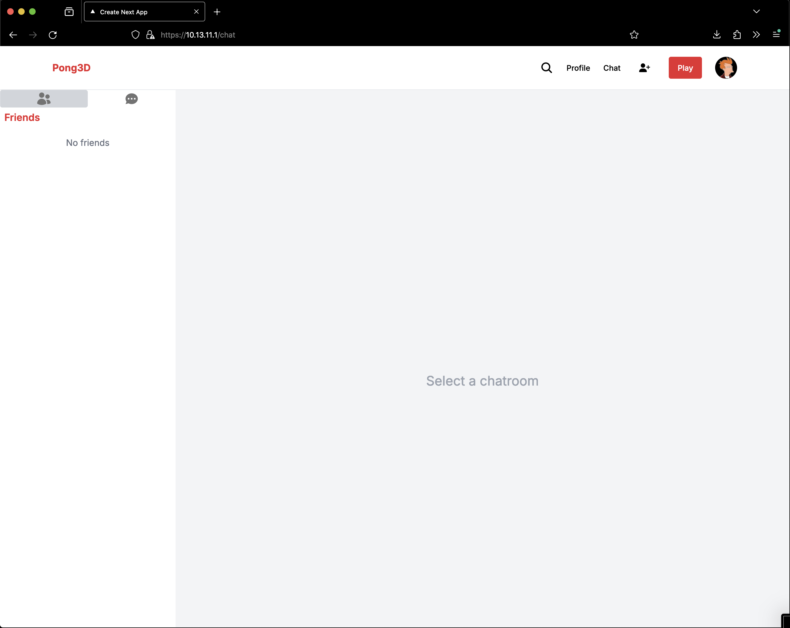
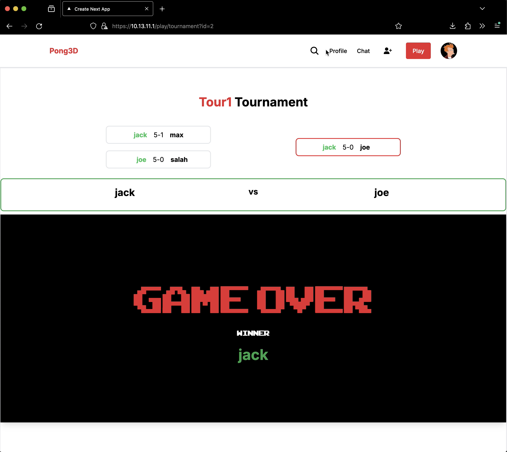
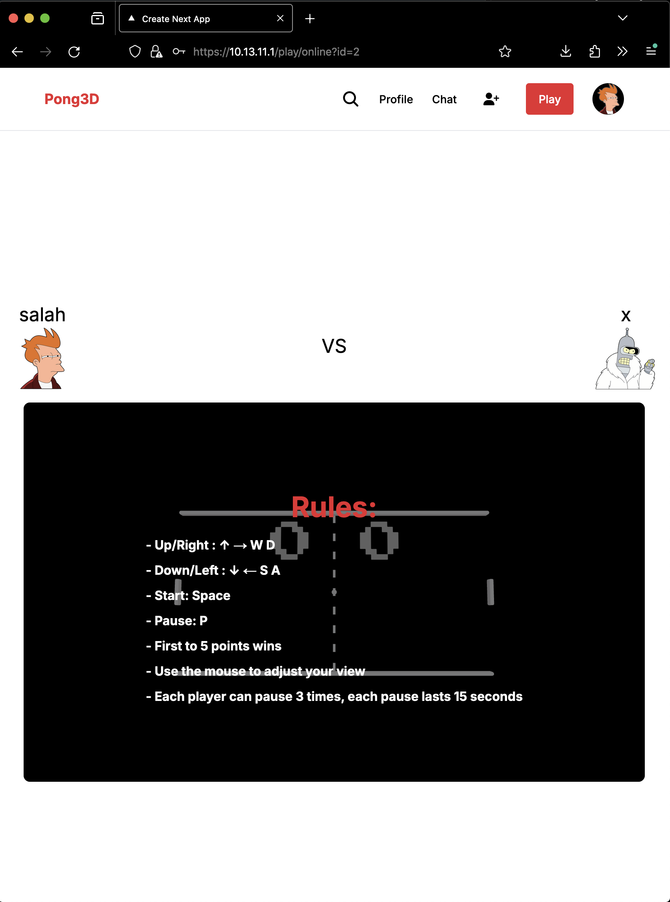

# ft_transcendence
**Table of Contents:**
- [Description](#description)
- [Tech Stack](#tech-stack)
- [Modules](#modules)
- [Setup](#setup)
- [Screenshots](#screenshots)
- [Demos](#demos)

## Description

[ft_transcendence](./assets/en.subject.pdf) is a web application that allows users to play a 3D version of the classic Pong game. The game is implemented using NextJS and ThreeJS and the backend is implemented using Django. Users can play against each other Localy , remotely, play against an AI opponent, create tournaments,and customize the game. The project also includes user management, authentication, and live chat.


## Tech Stack

| Category  | Technology |
| ------------- | ------------- |
| **Languages** |   |
| **Frontend**  |   |
| **Backend** |   |
| **Database** |  |
| **Authentication** |  |
| **Containerization** |  |
| **Networking** |  |
| **Machine Learning** |  |
| **Caching** |  |
| **Tools** |    |

## Modules

- required:

| Module | Type | Description | Done |
| --- | --- | --- | --- |
| **Backend Framework** | Major | Django as a backend Framework | ✅ |
| **User Management** | Major | Standard user management, authentication, users across tournaments| ✅ |
| **Advanced 3D Techniques** | Major | The Pong game is implemented using Three.js | ✅ |
| **Remote Players** | Major | Users can play against each other remotely | ✅ |
| **Remote Authentication** | Major | OAuth 2.0 authentication with 42  | ✅ |
| **Live Chat** | Major | Users can send direct messages to other users | ✅ |
| **AI Opponent** | Major | Machine Learning AI Opponent trained with Reinforcement Learning | ✅ |
| **Server-Side Pong** | Major | Replacing Basic Pong with Server-Side Pong | ✅ |
| **Game Customization Options** | Minor | Users can customize the game | ✅ |
| **Database Backend** | Minor | PostgreSQL as a database backend | ✅ |
| **Browser Compatibility** | Minor | The Web App should be compatible with all major browsers | ✅ |

- stuff i added:

| Module | Description |Done |
| --- | --- | --- |
| **Real-Time Notifications** | Users can receive real-time notifications (game invites, new chat Messages...) | ✅ |
| **AI Difficulty Levels** | Users can select the difficulty level of the AI | ✅ |
| **Resumable Games** | Users can resume games and tournaments where they left off | ✅ |
| **Games History** | Users can see All the games they played (local, online, tournament, AI) | ✅ |
## Setup
1. Clone the repository
```bash
git clone https://github.com/s888n/ft_transcendence.git
```
2. Change the directory
```bash
cd ft_transcendence
```
3. replace `YOUR_IP` with your IP address in `example.env` and `frontend/example.env.production` files and rename them to `.env` and `.env.production` respectively.
4. Run the following command to start the project
```bash
docker compose up
```

**Note:** `Login with 42` will not work for you as it requires a 42 API key.

## Screenshots
||||
|---|---|---|
|containers|Login page|Dashboard|
| | |  | 
|Settings page|Play page|Chat page|
| | |  | 
|tournament page|game page||
| |  |  |
## Demos

### 3D Pong

https://github.com/user-attachments/assets/fccf9449-74d8-411e-809c-516cfdb12d0e

### Private Chat

https://github.com/user-attachments/assets/3032578b-5076-4b36-95be-9c7f76e69c68

### Online PVP game

https://github.com/user-attachments/assets/30c54028-2352-4701-94a0-be5d4f12d4db

### Creating a tournament

https://github.com/user-attachments/assets/a01987d5-93ba-482e-b81f-a27062594a24

### Local PVP game

https://github.com/user-attachments/assets/9bcbd7fc-d7e3-479e-a119-5458f4c61bc2

### AI game

https://github.com/user-attachments/assets/81e5d593-5d37-4bb9-969c-f3af6a80c293

### Game Cutomization

https://github.com/user-attachments/assets/4ad887b5-c476-439b-aaa0-181f50cb0fed

### AI training

https://github.com/user-attachments/assets/70c3c1d0-8932-4094-8b88-542e66245f3d

